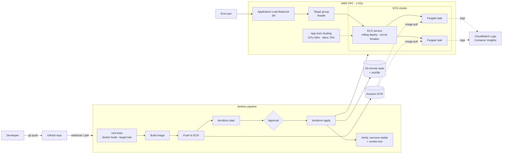

# Deploying a Containerized Application Using IaC

A Dockerized Python web app deployed to **AWS ECS Fargate**, with infrastructure defined in **Terraform** and delivery automated by a **Jenkins** CI/CD pipeline. The pipeline supports vertical scaling (task CPU/memory) and horizontal scaling (task count and autoscaling) through ECS service updates.

## Architecture



## Repository layout

```
.
├── app/                        # Flask app
│   ├── src/app.py              #   routes: /, /api/info, /health
│   ├── tests/                  #   pytest unit tests
│   ├── Dockerfile              #   multi-stage: base → test → runtime (non-root, healthcheck)
│   └── requirements*.txt
├── terraform/                  # Main infrastructure stack
│   ├── versions.tf             #   providers + S3 backend (native locking)
│   ├── variables.tf            #   all knobs incl. task_cpu/task_memory, min/max capacity
│   ├── locals.tf               #   naming, valid Fargate CPU/memory table
│   ├── network.tf              #   VPC, public subnets, IGW, security groups
│   ├── alb.tf                  #   ALB, target group, listener
│   ├── ecr.tf                  #   ECR repo + lifecycle policy
│   ├── iam.tf                  #   task execution role + task role
│   ├── ecs.tf                  #   cluster, task definition, service, log group
│   ├── autoscaling.tf          #   target-tracking scaling (CPU + memory)
│   ├── outputs.tf
│   └── bootstrap/              #   one-time S3 state bucket
├── Jenkinsfile                 # deploy | plan-only | scale | destroy
├── jenkins/                    # Jenkins controller image (docker, terraform, aws cli) + compose
├── scripts/scale-service.sh    # manual desired-count update
├── docker-compose.yml          # run the app locally
└── docs/
    ├── SETUP.md                # step-by-step setup guide
    └── jenkins-iam-policy.json # IAM policy for the Jenkins deployer
```

## Quick start

```bash
# 1. Run the app locally
docker compose up --build            # → http://localhost:8080

# 2. Create the Terraform state bucket (once)
cd terraform/bootstrap && terraform init && terraform apply -var="state_bucket_name=<unique-name>"

# 3. Start Jenkins, add the "aws-deployer" credential, create a Pipeline-from-SCM job
cd jenkins && docker compose up -d --build   # → http://localhost:8081

# 4. Build with Parameters → ACTION=deploy
```

Full walkthrough: **[docs/SETUP.md](docs/SETUP.md)**.

## Pipeline actions

| `ACTION` | What happens |
|----------|--------------|
| `deploy` | Test → build → push `<sha>-<build>` to ECR → plan → approve → apply → verify new version is live |
| `plan-only` | Test + `terraform plan`, no changes |
| `scale` | Keeps the current image; applies new `TASK_CPU`/`TASK_MEMORY` (new task def revision, rolling replace) and `MIN/MAX_TASKS`, then sets `DESIRED_COUNT` |
| `destroy` | `terraform plan -destroy` → mandatory approval → apply |

## Scaling model

| Type | Where | How it changes |
|------|-------|----------------|
| Vertical | `aws_ecs_task_definition.app` (`task_cpu`, `task_memory`) | New revision → ECS rolling deployment, zero downtime. Gunicorn workers follow vCPU. |
| Horizontal (auto) | `aws_appautoscaling_*` | Target tracking on average CPU (60%) and memory (75%) between min/max. |
| Horizontal (manual) | `scripts/scale-service.sh` | `aws ecs update-service --desired-count N`. Terraform ignores `desired_count` after creation so deploys don't reset it. |

## Safety features

- Immutable ECR tags, one per build: every deployment can be traced back to a commit.
- ECS deployment circuit breaker with automatic rollback.
- Manual approval before apply, always required for destroy.
- Tasks accept traffic only from the ALB security group, and the container runs as a non-root user.
- Terraform state is versioned and encrypted in S3, with lockfile-based locking.
- Invalid Fargate CPU/memory combinations are rejected at plan time.
