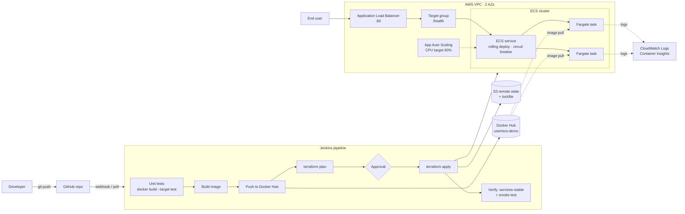

# Deploying a Containerized Application Using IaC

A Dockerized Python **calculator web app** deployed to **AWS ECS Fargate**, with infrastructure defined in **Terraform** and delivery automated by a **Jenkins** CI/CD pipeline. The pipeline supports vertical scaling (task CPU/memory) and horizontal scaling (task count and autoscaling) through ECS service updates.

## Architecture



## Repository layout

```
.
├── app/                        # Flask calculator app
│   ├── src/app.py              #   routes: / (UI), POST /api/calculate, /api/info, /health
│   ├── src/calculator.py       #   safe expression evaluator (AST whitelist, no eval)
│   ├── src/templates/index.html#   calculator UI (buttons, keyboard, history)
│   ├── tests/                  #   pytest unit tests (calculator + API)
│   ├── Dockerfile              #   multi-stage: base → test → runtime (non-root, healthcheck)
│   └── requirements*.txt
├── terraform/                  # Main infrastructure stack
│   ├── provider.tf             #   Terraform + AWS provider, S3 backend, name prefix
│   ├── variables.tf            #   all inputs incl. task_cpu/task_memory, min/max capacity
│   ├── network.tf              #   VPC, public subnets, IGW, security groups
│   ├── alb.tf                  #   ALB, target group, listener
│   ├── iam.tf                  #   execution role + task role
│   ├── ecs.tf                  #   cluster, task definition, service, log group
│   ├── autoscaling.tf          #   target-tracking scaling on CPU
│   ├── outputs.tf
│   └── bootstrap/              #   one-time S3 state bucket
├── Jenkinsfile                 # deploy | plan-only | scale | destroy
├── jenkins/                    # Jenkins controller image (docker, terraform, aws cli) + compose
├── scripts/scale-service.sh    # manual desired-count update
├── docker-compose.yml          # run the app locally
└── docs/
    ├── SETUP.md                # step-by-step setup guide
    ├── RUN-GUIDE.md            # step-by-step run guide (Windows)
    ├── APP-CODE-GUIDE.md       # explanation of the application code and tests
    ├── TERRAFORM-GUIDE.md      # explanation of the Terraform structure and logic
    └── jenkins-iam-policy.json # IAM policy for the Jenkins deployer
```

## Quick start

```bash
# 1. Run the app locally
docker compose up --build            # → http://localhost:8080

# 2. Create the Terraform state bucket (once)
cd terraform/bootstrap && terraform init && terraform apply -var="bucket_name=<unique-name>"

# 3. Set DOCKERHUB_REPO + TF_STATE_BUCKET in the Jenkinsfile
# 4. Start Jenkins, add the "aws-deployer" and "dockerhub" credentials, create a Pipeline-from-SCM job
cd jenkins && docker compose up -d --build   # → http://localhost:8081

# 5. Build with Parameters → ACTION=deploy
```

Step-by-step for Windows: **[RUN-GUIDE.md](docs/RUN-GUIDE.md)**. Reference details: **[docs/SETUP.md](docs/SETUP.md)**. How the app code works: **[docs/APP-CODE-GUIDE.md](docs/APP-CODE-GUIDE.md)**. How the infrastructure works: **[docs/TERRAFORM-GUIDE.md](docs/TERRAFORM-GUIDE.md)**.

## Calculator API

| Method | Path | Description |
|--------|------|-------------|
| GET | `/` | Calculator UI: buttons, keyboard input, last 10 results |
| POST | `/api/calculate` | Body `{"expression": "(2 + 3) × 4 ^ 2"}` → `{"result": 80, ...}`; errors return `400 {"error": "Division by zero"}` |
| GET | `/api/info` | Version, environment, task hostname (used by the pipeline smoke test) |
| GET | `/health` | ALB and container health check |

Supported: numbers, `+ − × ÷ %`, `^` (power), parentheses, unary minus. Expressions are parsed into an AST and only arithmetic nodes are evaluated, so arbitrary code is rejected. Length, exponent and result size are capped to keep requests cheap.

## Pipeline actions

| `ACTION` | What happens |
|----------|--------------|
| `deploy` | Test → build → push `<sha>-<build>` and `latest` to Docker Hub → plan → approve → apply → verify new version is live |
| `plan-only` | Test + `terraform plan`, no changes |
| `scale` | Keeps the current image; applies new `TASK_CPU`/`TASK_MEMORY` (new task def revision, rolling replace) and `MIN/MAX_TASKS`, then sets `DESIRED_COUNT` |
| `destroy` | `terraform plan -destroy` → mandatory approval → apply |

## Scaling model

| Type | Where | How it changes |
|------|-------|----------------|
| Vertical | `aws_ecs_task_definition.app` (`task_cpu`, `task_memory`) | New revision → ECS rolling deployment, zero downtime. Gunicorn workers follow vCPU. |
| Horizontal (auto) | `aws_appautoscaling_*` | Target tracking keeps average CPU near 60%, between min/max. |
| Horizontal (manual) | `scripts/scale-service.sh` | `aws ecs update-service --desired-count N`. Terraform ignores `desired_count` after creation so deploys don't reset it. |

## Safety features

- Unique image tag per build (`<git-sha>-<build>`): every deployment can be traced back to a commit, and ECS always pulls an exact version rather than `latest`.
- Docker Hub is logged into with an access token (never a password) and logged out after each push.
- ECS deployment circuit breaker with automatic rollback.
- Manual approval before apply, always required for destroy.
- Tasks accept traffic only from the ALB security group, and the container runs as a non-root user.
- Terraform state is versioned and encrypted in S3, with lockfile-based locking.
